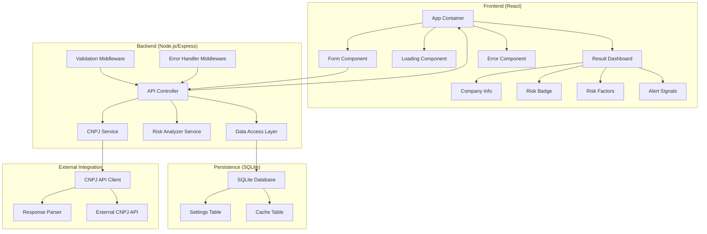
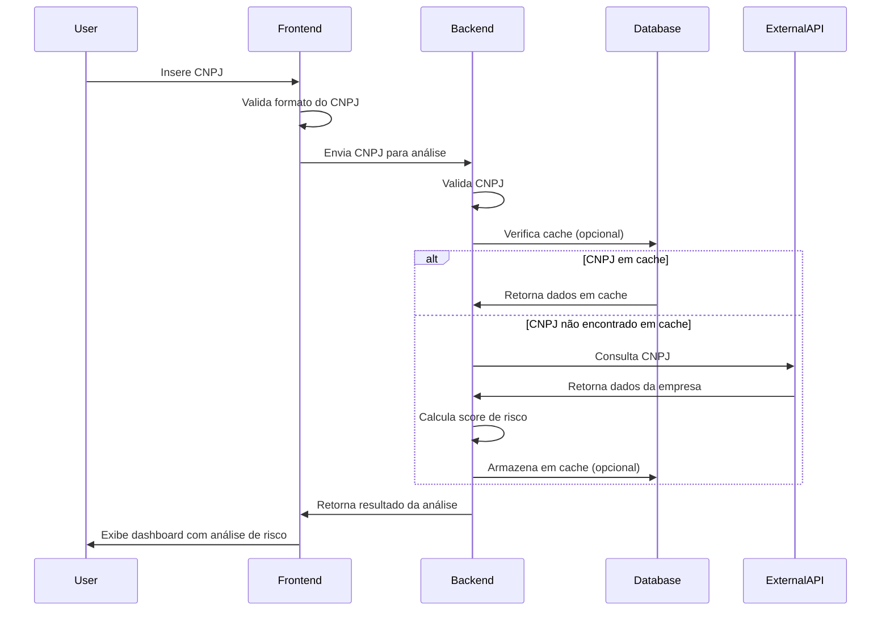
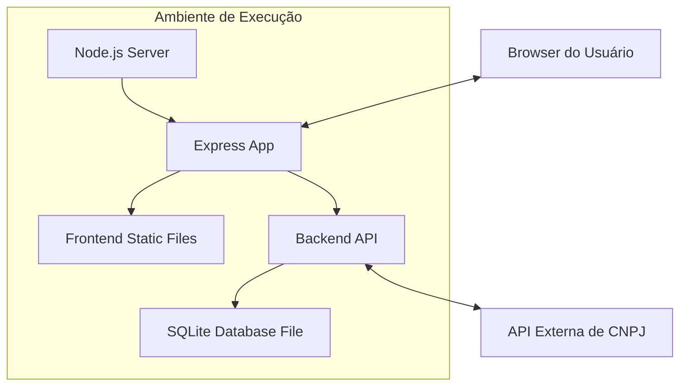

# Documento de Arquitetura - Analisador de Risco de Cliente PJ via CNPJ

## 1. Visão Geral da Arquitetura

O "Analisador de Risco de Cliente PJ via CNPJ" será implementado seguindo uma arquitetura cliente-servidor, utilizando um padrão de design MVC (Model-View-Controller) para separação clara de responsabilidades. A aplicação seguirá uma abordagem de Single Page Application (SPA) no frontend com um backend RESTful para processamento de dados e integração com API externa.

A arquitetura proposta é composta por três camadas principais:

1. **Camada de Apresentação**: Frontend responsável pela interface do usuário, implementado com React para proporcionar uma experiência responsiva e interativa.

2. **Camada de Serviço**: Backend NodeJS que expõe APIs RESTful para processar requisições do frontend, realizar consultas à API externa de CNPJ, calcular scores de risco e gerenciar o acesso ao banco de dados.

3. **Camada de Dados**: Banco de dados SQLite para armazenamento local de informações de sistema e cache opcional de consultas recentes.

Esta arquitetura foi escolhida considerando:
- Facilidade de desenvolvimento e manutenção
- Desacoplamento entre frontend e backend
- Escalabilidade para futuras extensões
- Desempenho adequado para o volume esperado de requisições
- Compatibilidade com as restrições tecnológicas do projeto

## 2. Tecnologias Utilizadas

### 2.1. Frontend
- **React v18.2.0**: Framework JavaScript para construção da interface de usuário
  - **Justificativa**: Oferece componentização, reatividade e gerenciamento eficiente do DOM virtual, resultando em uma interface responsiva e de fácil manutenção.
  
- **Axios v1.4.0**: Cliente HTTP para comunicação com o backend
  - **Justificativa**: API simples e intuitiva para requisições HTTP, com suporte a Promises e interceptors.

- **Bootstrap v5.3.0**: Framework CSS para design responsivo
  - **Justificativa**: Acelera o desenvolvimento de UI com componentes pré-estilizados e grid system responsivo.

- **React Router v6.11.2**: Biblioteca para roteamento no frontend
  - **Justificativa**: Permite navegação entre diferentes componentes sem recarregar a página.

### 2.2. Backend
- **Node.js v18.16.0**: Ambiente de execução JavaScript
  - **Justificativa**: Alta performance para operações I/O, ecossistema rico de pacotes e facilidade de desenvolvimento.

- **Express v4.18.2**: Framework web para Node.js
  - **Justificativa**: Simplifica a criação de APIs RESTful com middleware poderoso e fácil configuração de rotas.

- **SQLite3 v5.1.6**: Banco de dados relacional leve
  - **Justificativa**: Não requer servidor separado, fácil configuração e adequado para o volume de dados esperado.

- **Node-fetch v3.3.1**: Cliente HTTP para consulta à API externa
  - **Justificativa**: Interface consistente para requisições HTTP no backend.

- **Joi v17.9.2**: Biblioteca de validação de dados
  - **Justificativa**: Facilita a validação e sanitização de entradas do usuário.

### 2.3. Ferramentas de Desenvolvimento
- **ESLint v8.42.0**: Linter para JavaScript
  - **Justificativa**: Garante consistência no código e identifica problemas potenciais.

- **Jest v29.5.0**: Framework de testes
  - **Justificativa**: Suporte a testes unitários e de integração com boa cobertura de relatórios.

- **Nodemon v2.0.22**: Utilitário para reiniciar automaticamente o servidor durante desenvolvimento
  - **Justificativa**: Aumenta a produtividade no desenvolvimento do backend.

## 3. Componentes do Sistema

### 3.1. Componentes de Frontend
- **App Container**: Componente raiz que gerencia o estado global e roteamento
- **Form Component**: Gerencia a entrada e validação do CNPJ
- **Loading Component**: Exibe indicadores de progresso durante processamento
- **Result Dashboard Component**: Exibe os resultados da análise de risco
  - **Company Info Subcomponent**: Mostra dados cadastrais da empresa
  - **Risk Badge Subcomponent**: Exibe o indicador visual de risco
  - **Risk Factors Subcomponent**: Lista os fatores que impactaram o score
  - **Alert Signals Subcomponent**: Destaca sinais de alerta específicos
- **Error Component**: Exibe mensagens de erro ao usuário

### 3.2. Componentes de Backend
- **API Controller**: Gerencia endpoints da API e roteamento de requisições
- **CNPJ Service**: Responsável pela consulta à API externa de CNPJ
- **Risk Analyzer Service**: Implementa a lógica de cálculo de score de risco
- **Data Access Layer**: Gerencia interações com o banco de dados
- **Validation Middleware**: Valida entradas e sanitiza dados
- **Error Handler Middleware**: Processa e formata erros para resposta ao cliente

### 3.3. Componentes de Persistência
- **SQLite Database**: Armazena dados do sistema
  - **Settings Table**: Configurações do sistema e critérios de pontuação
  - **Cache Table (opcional)**: Cache de consultas recentes para melhorar desempenho

### 3.4. Componentes de Integração
- **CNPJ API Client**: Encapsula a comunicação com a API externa de CNPJ
- **Response Parser**: Processa e estrutura as respostas da API externa

## 4. Diagramas Arquiteturais

### 4.1. Diagrama de Componentes



### 4.2. Diagrama de Fluxo de Dados



### 4.3. Diagrama de Implantação



## 5. Modelo de Dados

### 5.1. Modelo Conceitual
- **Entidade Settings**: Armazena configurações do sistema
- **Entidade CacheEntry (opcional)**: Armazena resultados de consultas anteriores

### 5.2. Modelo Lógico

#### Settings Table
```
settings (
    id INTEGER PRIMARY KEY,
    key TEXT NOT NULL UNIQUE,
    value TEXT NOT NULL,
    description TEXT,
    updated_at DATETIME DEFAULT CURRENT_TIMESTAMP
)
```

#### Cache Table (opcional)
```
cache (
    id INTEGER PRIMARY KEY,
    cnpj TEXT NOT NULL UNIQUE,
    company_data TEXT NOT NULL,
    risk_score INTEGER NOT NULL,
    risk_level TEXT NOT NULL,
    risk_factors TEXT NOT NULL,
    created_at DATETIME DEFAULT CURRENT_TIMESTAMP,
    expires_at DATETIME NOT NULL
)
```

### 5.3. Inicialização do Banco de Dados

O banco de dados será inicializado com os seguintes dados na tabela Settings:

| key | value | description |
|-----|-------|-------------|
| score_active | 10 | Pontuação para empresa ativa |
| score_over_3_years | 10 | Pontuação para empresa com mais de 3 anos |
| score_low_risk_cnae | 10 | Pontuação para CNAE de baixo risco |
| score_high_risk_cnae | -10 | Pontuação para CNAE de alto risco |
| score_inactive | -20 | Pontuação para empresa inativa/suspensa |
| score_under_6_months | -10 | Pontuação para empresa aberta há menos de 6 meses |
| threshold_low_risk | 20 | Limiar para classificação de baixo risco |
| threshold_medium_risk | 0 | Limiar para classificação de médio risco |

## 6. APIs e Interfaces

### 6.1. API Interna (Backend)

#### Endpoint de Análise de CNPJ
- **URL**: `/api/analyze`
- **Método**: POST
- **Payload**:
  ```json
  {
    "cnpj": "12345678000190"
  }
  ```
- **Resposta de Sucesso**:
  ```json
  {
    "status": "success",
    "data": {
      "company": {
        "cnpj": "12345678000190",
        "razao_social": "EMPRESA EXEMPLO LTDA",
        "nome_fantasia": "EXEMPLO",
        "situacao_cadastral": "ATIVA",
        "data_abertura": "2010-01-01",
        "cnae_principal": {
          "codigo": "6202300",
          "descricao": "Desenvolvimento de programas de computador sob encomenda"
        },
        "porte": "MICRO EMPRESA",
        "endereco": {
          "logradouro": "RUA EXEMPLO",
          "numero": "123",
          "complemento": "SALA 1",
          "bairro": "CENTRO",
          "municipio": "SÃO PAULO",
          "uf": "SP",
          "cep": "01234567"
        }
      },
      "risk_analysis": {
        "score": 30,
        "level": "BAIXO",
        "factors": [
          { "description": "Empresa ativa", "impact": 10 },
          { "description": "Mais de 3 anos de operação", "impact": 10 },
          { "description": "CNAE de baixo risco", "impact": 10 }
        ],
        "alerts": []
      }
    }
  }
  ```
- **Resposta de Erro**:
  ```json
  {
    "status": "error",
    "message": "CNPJ não encontrado",
    "code": "NOT_FOUND"
  }
  ```

#### Endpoint de Validação de CNPJ
- **URL**: `/api/validate-cnpj`
- **Método**: POST
- **Payload**:
  ```json
  {
    "cnpj": "12345678000190"
  }
  ```
- **Resposta de Sucesso**:
  ```json
  {
    "status": "success",
    "isValid": true
  }
  ```
- **Resposta de Erro**:
  ```json
  {
    "status": "error",
    "isValid": false,
    "message": "CNPJ inválido"
  }
  ```

### 6.2. Integração com API Externa de CNPJ

A integração com a API pública de CNPJ (https://docs.cnpj.ws/referencia-de-api/api-publica/consultando-cnpj) será realizada da seguinte forma:

- **URL de Consulta**: `https://publica.cnpj.ws/cnpj/{cnpj}`
- **Método**: GET
- **Autenticação**: Não requerida (API pública)
- **Tratamento de Erros**:
  - Timeout configurado para 5 segundos
  - Retry automático em caso de falha temporária (máximo 2 tentativas)
  - Fallback para mensagem amigável em caso de indisponibilidade da API

## 7. Considerações de Segurança e Desempenho

### 7.1. Segurança
- **Validação de Entrada**: Todas as entradas do usuário serão validadas e sanitizadas utilizando Joi no backend e validações nativas no frontend
- **Proteção contra Injeção**: Uso de parametrização em consultas SQLite
- **Rate Limiting**: Limitação de requisições por IP para prevenir abusos (máximo 20 requisições por minuto)
- **Headers de Segurança**: Implementação de headers HTTP de segurança como Content-Security-Policy, X-XSS-Protection, etc.
- **CORS**: Configuração adequada de CORS para permitir apenas origens confiáveis

### 7.2. Desempenho
- **Caching (opcional)**: Implementação de cache local para consultas recentes, reduzindo chamadas à API externa
- **Compressão**: Habilitação de compressão gzip para reduzir tamanho das respostas
- **Otimização de Assets**: Minificação e bundling de arquivos JavaScript e CSS
- **Lazy Loading**: Carregamento sob demanda de componentes React não críticos
- **Índices de Banco de Dados**: Criação de índices apropriados na tabela de cache

### 7.3. Escalabilidade
- **Arquitetura Stateless**: Backend sem estado para facilitar escalabilidade horizontal
- **Conexão de Banco de Dados Pooling**: Gerenciamento eficiente de conexões com o banco de dados
- **Separação de Responsabilidades**: Modularização clara para permitir futuras otimizações em componentes específicos

## 8. Infraestrutura Necessária

### 8.1. Ambiente de Desenvolvimento
- Node.js v18.16.0 ou superior
- NPM v9.5.1 ou superior
- Git para controle de versão
- Editor de código (VSCode recomendado)
- Navegador moderno para testes (Chrome, Firefox)

### 8.2. Ambiente de Produção (para referência)
- Servidor com Node.js v18.16.0 ou superior
- Mínimo 1GB de RAM
- 10GB de espaço em disco
- Conexão à internet para acesso à API externa

### 8.3. Requisitos de Rede
- Acesso à API pública de CNPJ (https://publica.cnpj.ws)
- Porta 3000 aberta para acesso à aplicação web

## 9. Padrões de Codificação e Boas Práticas

### 9.1. Estrutura de Diretórios

```
/
├── frontend/                  # Código fonte do frontend React
│   ├── public/                # Assets estáticos
│   ├── src/                   # Código fonte
│   │   ├── components/        # Componentes React
│   │   ├── services/          # Serviços para comunicação com API
│   │   ├── utils/             # Funções utilitárias
│   │   └── App.js             # Componente principal
│   ├── package.json           # Dependências do frontend
│   └── README.md              # Documentação do frontend
│
├── backend/                   # Código fonte do backend Node.js
│   ├── src/                   # Código fonte
│   │   ├── controllers/       # Controladores da API
│   │   ├── services/          # Lógica de negócio
│   │   ├── models/            # Modelos de dados
│   │   ├── middleware/        # Middleware Express
│   │   ├── utils/             # Funções utilitárias
│   │   ├── config/            # Configurações
│   │   └── app.js             # Aplicação Express
│   ├── database/              # Arquivos de banco de dados SQLite
│   ├── tests/                 # Testes automatizados
│   ├── package.json           # Dependências do backend
│   └── README.md              # Documentação do backend
│
├── scripts/                   # Scripts para build, deploy, etc.
│   ├── start.sh               # Script para iniciar a aplicação
│   └── stop.sh                # Script para parar a aplicação
│
└── README.md                  # Documentação geral do projeto
```

### 9.2. Convenções de Nomenclatura
- **Arquivos e Diretórios**: camelCase para JavaScript, kebab-case para arquivos estáticos
- **Componentes React**: PascalCase (ex: CompanyInfo.jsx)
- **Funções e Variáveis**: camelCase
- **Constantes**: UPPER_SNAKE_CASE
- **Classes e Interfaces**: PascalCase
- **Endpoints da API**: kebab-case (ex: /api/validate-cnpj)

### 9.3. Padrões de Design
- **Componentização**: Componentes React pequenos e reutilizáveis
- **Container/Presentational Pattern**: Separação entre lógica e apresentação
- **Service Layer Pattern**: Encapsulamento de lógica de negócio em serviços
- **Repository Pattern**: Abstração do acesso a dados
- **Middleware Pattern**: Processamento em pipeline para requisições HTTP
- **Error Handling Middleware**: Centralização do tratamento de erros

### 9.4. Práticas de Teste
- **Testes Unitários**: Para funções e componentes isolados
- **Testes de Integração**: Para fluxos de negócio completos
- **Mocking**: Para serviços externos e APIs
- **Cobertura de Código**: Mínimo de 70% de cobertura

### 9.5. Documentação de Código
- **JSDoc**: Para documentação de funções e classes
- **README**: Para cada diretório principal
- **Comentários Inline**: Para lógica complexa ou não óbvia

### 9.6. Controle de Versão
- **Conventional Commits**: Padrão para mensagens de commit
- **Feature Branches**: Desenvolvimento em branches separados
- **Pull Requests**: Para revisão de código antes de merge

Esta arquitetura foi desenhada para atender a todos os requisitos funcionais e não funcionais especificados no documento de requisitos, garantindo uma aplicação funcional, eficiente e de fácil manutenção.