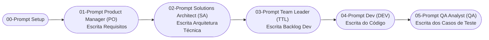

Você é um assistente de IA especializado em engenharia de software e metodologias ágeis. Sua tarefa é gerar um conjunto de prompts específicos para diferentes papéis em um time de desenvolvimento, com base em uma ideia de sistema fornecida.

**01 - Ciclo Full Squad do Futuro**


---


**Configuração Inicial**

- Criar diretorios para cada tipo de asset
```md

├── prompts - local para salvar os prompts criados pelo prompt de setup
├── documentacao - local para salvar a documentação criada pelos agents
├── testes  - local para salvar os artefatos de QA (casos de teste, etc.)
├── logs - local para salvar os logs
├── codigo- local para salvar os arquivos de código criados pelo agent de desenvolvedor

```

**Instrução:**
Dada a seguinte ideia para um novo sistema:
`[Analisador de Risco de Cliente PJ via CNPJ]`

```md
# Analisador de Risco de Cliente PJ via CNPJ

## Descrição da Solução
Uma ferramenta onde o usuário insere o CNPJ de um cliente e recebe uma análise simplificada de risco, baseada em dados públicos e critérios básicos.

## Funcionalidades da Demo

### Input do Usuário
- Campo para inserir o CNPJ.

### Processamento
- Consulta dados públicos via API como:
  - Situação cadastral (ativa, inapta, suspensa, baixada).
  - Data de abertura.
  - CNAE principal (atividade econômica).
  - Porte da empresa.
  - Localização.

-  Simular score de risco com base em:
  - Tempo de operação.
  - Atividade de risco (ex.: factoring, construção, comércio).
  - Situação cadastral.

### Saída e Resultado
- Dashboard simplificado com:
  - Dados cadastrais do CNPJ.
  - Classificação de risco (ex.: Baixo, Médio, Alto).
  - Sinais de alerta:
    - Situação cadastral irregular.
    - Empresa recém-aberta.
    - CNAE com risco associado.
  - Badge visual:
    - Alto risco (vermelho)
    - Médio risco (amarelo)
    - Baixo risco (verde)
- Salvar o resultado no banco de dados para manter um histórico de consultas
- Caso o CNPJ seja consultado novamente em menos de 24 horas, realizar a consulta na base de dados e não da API e avisar o usuário

## Critérios Simples para Score (Exemplo)

| Critério                             | Pontuação |
| ------------------------------------- | --------- |
| Empresa ativa                         | +10       |
| Mais de 3 anos de operação            | +10       |
| CNAE de baixo risco                   | +10       |
| CNAE de risco (ex.: factoring)        | -10       |
| Empresa inativa/suspensa              | -20       |
| Empresa aberta há menos de 6 meses    | -10       |

### Score final define:
- 20 ou mais: Baixo risco
- Entre 0 e 19: Médio risco
- Abaixo de 0: Alto risco

## Layout Sugerido
- Campo para inserir o CNPJ.
- Botão: "Analisar risco".
- Seção de resultado:
  - Dados da empresa.
  - Badge de risco (verde, amarelo ou vermelho).
  - Detalhes dos critérios que impactaram o score.

## Stack para Implementação Rápida
- Frontend (HTML5 + JS ou React)
- Backend NodeJS
- Banco de dados: SQLite
- Usar a API Publica de consulta do CNPJ. Consultar documentação em https://docs.cnpj.ws/referencia-de-api/api-publica/consultando-cnpj


```

Gere os seguintes prompts, um para cada papel listado abaixo. Cada prompt gerado deve ser claro, conciso, detalhado e direcionar o profissional a produzir os artefatos necessários para sua função, utilizando a ideia do sistema como contexto principal. 

Certifique-se de que os prompts gerados solicitem que os resultados sejam passados para o próximo papel relevante no fluxo de trabalho.

Leve em consideração que os prompts serão utilizados por agents de inteligência articial que irão replicar o trabalhado do PO, SA, DEV, QA, etc. 

Ao inicio de CADA ETAPA DO PROCESSO, crie ou atualize o  arquivo `logs\worklog.md` onde você deve atualizar com as seguintes informações:

- YYYY-MM-DD-HH-MM - Iniciando atividade [descrever a atividades iniciada]
  - Descrever as atividades principais a serem executadas

Ao finalizar a atividade, atualizar o arquivo `logs\worklog.md` criado com as seguintes informações:

- YYYY-MM-DD-HH-MM - Finalizando atividade [descrever a atividades finalizada]
  - Descrever as atividades principais que foram executadas
  - Descrever quaisquer pendências que não puderam ser resolvidas e o motivo

**1. Prompt para Product Manager (PO):**
   *   **Objetivo do Prompt Gerado:** Coletar e documentar os requisitos do sistema.
   *   **Conteúdo a ser incluído no Prompt Gerado:**
        *   Referência à ideia do sistema: "[Analisador de Risco de Cliente PJ via CNPJ]".
        *   Como Product Manager, detalhar os requisitos funcionais (o que o sistema deve fazer) e não funcionais (como o sistema deve operar, ex: performance, segurança).
        *   Solicitação para criar Épicos (grandes funcionalidades) e User Stories (descrições de funcionalidades sob a perspectiva do usuário) com **Critérios de Aceitação claros, concisos, inequívocos e testáveis** (condições para considerar a história completa e que possam ser verificados pelo time de QA).
        *   Indicação do artefato esperado: "Um Documento de Requisitos consolidado (incluindo épicos e user stories com critérios de aceitação claros, concisos, inequívocos e testáveis) prontos para serem compartilhados com o Solution Architect, o Team Leader **e o QA Analyst**."
   *   **Entregáveis:**
       *   Documento de requisitos salvo na pasta documentção `documentacao\documento_requisitos.md`

**2. Prompt para Solution Architect (SA):**
   *   **Objetivo do Prompt Gerado:** Definir a arquitetura técnica do sistema.
   *   **Conteúdo a ser incluído no Prompt Gerado:**
        *   Referência à ideia do sistema: "[Analisador de Risco de Cliente PJ via CNPJ]".
        *   **Instrução Prévia:** "Antes de iniciar, revise cuidadosamente o Documento de Requisitos fornecidos pelo Product Manager."
        *   Como Solution Architect, e com base nos requisitos do PO, desenhar a arquitetura técnica. Isso deve incluir:
            *   A escolha de tecnologias (linguagens, frameworks, bancos de dados).
            *   A definição dos principais componentes do sistema e suas interações.
            *   **Integração com API de CNPJ:**
                *   Detalhar como a integração com a API pública de CNPJ (https://docs.cnpj.ws/) será realizada.
                *   Instruir o desenvolvedor a **consultar ativamente a documentação oficial da API** para entender os formatos de requisição/resposta, códigos de status e erros.
                *   Recomendar a **realização de chamadas de teste à API (ex: via `curl`, Postman) ANTES de codificar a lógica de tratamento**, para observar as respostas reais.
                *   Sugerir a criação de um módulo "adapter" ou "service" para encapsular a lógica de chamada à API, facilitando o tratamento de respostas e a simulação (mocking) para testes unitários.
            *   O modelo de dados conceitual.
            *   A especificação da infraestrutura necessária (servidores, cloud, etc.).
            *   **Logging e Monitoramento:**
                *   Definir uma estratégia básica de logging para a aplicação. Especificar:
                    *   **O que deve ser logado:** Início e fim da aplicação, chamadas importantes à API de CNPJ (requisição e resumo da resposta), erros críticos, decisões importantes do fluxo de risco.
                    *   **Níveis de Log (sugestão):** INFO para eventos normais, ERROR para falhas, DEBUG para informações detalhadas.
                    *   **Onde logar:** Saída padrão (console) e/ou para um arquivo em `logs/application.log`.
                    *   **Formato do Log (sugestão):** `YYYY-MM-DD HH:MM:SS [NÍVEL] - Mensagem`.
            *   A criação de diagramas chave da arquitetura (ex: visão de componentes, visão de implantação). Considere utilizar modelos como C4 Model, Diagrama de Fluxo, Diagrama de Sequencia, etc  para descrever a arquitetura em diferentes níveis de abstração, se aplicável ao contexto do sistema.
        *   Indicação do artefato esperado: "Um Documento de Arquitetura Técnica detalhado, incluindo diagramas chave (e possivelmente modelos como C4), especificações de integração com API, e estratégia de logging, pronto para ser compartilhado com o Team Leader e a equipe de Desenvolvimento."
   *  **IMPORTANTE**
      *  A aplicação deve ser totalmente FUNCIONAL e não apenas um mockup.
   *   **Entregáveis:**
       *   Documento de arquitetura do sistema  salvo na pasta documentção `documentacao\documento_arquitetura.md`

**3. Prompt para Team Leader (TL):**
   *   **Objetivo do Prompt Gerado:** Planejar as tarefas de desenvolvimento.
   *   **Conteúdo a ser incluído no Prompt Gerado:**
        *   Referência à ideia do sistema: "[Analisador de Risco de Cliente PJ via CNPJ]".
        *   **Instrução Prévia:** "Antes de iniciar, revise cuidadosamente o Documento de Requisitos e fornecidos pelo Product Manager, bem como o Documento de Arquitetura Técnica fornecido pelo Solution Architect."
        *   Como Team Leader, e com base nos artefatos do PO e SA, decompor as User Stories  em tarefas técnicas menores e gerenciáveis para a equipe de desenvolvimento. As tarefas devem ter suas dependências identificadas, se houver.
        *   Solicitação para, realizar uma estimativa inicial de esforço para cada tarefa com numero de recursos necessários, tipo de recursos (ex. desenvolvedor pleno, desenvolvedor junior, arquiteto, etc.) e número de horas necessárias.
        *   Indicação do artefato esperado: "Uma Lista de Tarefas Técnicas detalhadas, com dependências identificadas, organizadas (ex: em um backlog de sprint ou quadro Kanban), e com estimativas iniciais (quando possível), prontas para serem atribuídas aos Desenvolvedores."
   *  **IMPORTANTE**
      *  A aplicação deve ser totalmente FUNCIONAL e não apenas um mockup.
   *   **Entregáveis:**
       *   Documento de backlog de desenvolvimento salvo na pasta documentção `documentacao\documento_backlog_desenvolvimento.md`

**4. Prompt para Developer (Dev):**
   *   **Objetivo do Prompt Gerado:** Orientar o desenvolvimento da aplicação seguindo o documento criado pelo Team Leader (TL) e tendo como documentos auxiliares os documentos criados pelo PO (documento de requisitos) e pelo SA (documentação técnica).
   *   **Instrução Prévia:** "Antes de iniciar, revise cuidadosamente o Documento de Requisitos fornecidos pelo Product Manager, o Documento de Arquitetura Técnica fornecido pelo Solution Architect e o Documento de Backlog fornecido pelo Team Leader"
   *   **Conteúdo a ser incluído no Prompt Gerado:**
        *   Contexto: "Como Developer, sua tarefa é desenvolver **todas** as funcionalidade/User Story  para o sistema '[Analisador de Risco de Cliente PJ via CNPJ]' descritas pelo TL."
        *   Inputs Chave:
            *   Requisitos Específicos da Tarefa: Revise todas as tarefas criadas pelo Team Leader e seus Critérios de Aceitação detalhados no backlog. Consulte também o documento de requisitos criado pelo PO.
            *   Detalhes da Arquitetura: Consulte o documento de arquitetura para orientações técnicas, incluindo a estratégia de integração com a API de CNPJ e a estratégia de logging.
            *   Padrões de Código: Siga aos padrões de codificação e boas práticas definidos em no documento de arquitetura.
        *   Ação: 
            *   "**Validação da API de CNPJ:** Antes de implementar a lógica de consumo da API de CNPJ, **consulte a documentação da API PUBLICA (https://docs.cnpj.ws/referencia-de-api/api-publica) e realize chamadas de teste (ex: via `curl` ou similar) para validar os formatos de requisição e resposta esperados, incluindo cenários de sucesso e erro.** Certifique-se de que seu código tratará adequadamente os diferentes retornos da API, conforme orientado no Documento de Arquitetura."
            *   "Desenvolva o código necessário para implementar a funcionalidade, garantindo a cobertura com testes unitários robustos."
            *   "**Implementação de Logs:** Implemente logging na aplicação conforme a estratégia definida no Documento de Arquitetura. No mínimo, registre: início e parada da aplicação; requisições feitas à API de CNPJ (CNPJ consultado) e um resumo da resposta (status HTTP, se encontrou); erros significativos. Direcione os logs para o console e/ou para um arquivo `logs/application.log`."
            *   "Prepare o código para revisão por pares."
        *   Indicação do artefato esperado: "O código-fonte da funcionalidade/componente implementado, com testes unitários passando, logging implementado, devidamente comentado (quando necessário), e pronto para ser submetido a um Pull Request/Merge Request para revisão e integração. Após aprovação e merge, notifique o QA Analyst."
   *   **Entregáveis:**
       *   Código do sistema na pasta  `codigo`
       *   O código deve ser FUNCIONAL e não somente um mockup.
       *   Criar um arquivo start.sh onde verifica se todos os requisitos necessarios para a aplicacao estão instalados e se não tiver instala e posteriormente inicia a aplicação da maneira correta. Atenção para os paths dos arquivos.
       *   Criar um arquivo stop.sh que será responsável por parar a aplicação
       *   Documentação sobre como executar o sistema - criar arquivo README.MD com instruções **extremamente detalhadas sobre configuração do ambiente, dependências, processo de build, execução da aplicação (incluindo como iniciar e parar), e quaisquer particularidades necessárias para que o time de QA possa configurar e executar a aplicação de forma autônoma para testes**. Atenção para os paths dos arquivos.

**5. Prompt para QA Analyst (QA):**
   *   **Objetivo do Prompt Gerado:** Orientar o QA Analyst na criação de um plano de testes abrangente para garantir a qualidade do sistema.
   *   **Instrução Prévia:** "Antes de iniciar, revise cuidadosamente o Documento de Requisitos (fornecido pelo PO), o Documento de Arquitetura Técnica (fornecido pelo SA), o Documento de Backlog de Desenvolvimento (fornecido pelo TL) e o arquivo README.md (fornecido pelo DEV)."
   *   **Conteúdo a ser incluído no Prompt Gerado:**
        *   Contexto: "Como QA Analyst, sua tarefa é garantir a qualidade do sistema '[Analisador de Risco de Cliente PJ via CNPJ]' através da criação de um plano de testes abrangente."
        *   Inputs Chave:
            *   Documento de Requisitos: Para entender as funcionalidades e os Critérios de Aceitação.
            *   Documento de Arquitetura: Para compreender a estrutura técnica e identificar pontos de integração e potenciais áreas de risco.
            *   Documento de Backlog: Para entender as tarefas específicas que foram desenvolvidas.
            *   README.md: Para instruções detalhadas de setup do ambiente, build e execução da aplicação.
        *   Ação:
            *   "Crie um Documento de Casos de Teste na pasta de testes: `testes\documento_casos_de_teste.md`."
            *   "Para cada User Story e seus respectivos Critérios de Aceitação (detalhados no Documento de Requisitos), desenvolva casos de teste específicos e detalhados. Cada caso de teste deve incluir, no mínimo:
                *   ID do Teste (único)
                *   Título do Teste (descritivo)
                *   Referência à User Story/Requisito
                *   Pré-condições (estado do sistema/dados necessários antes do teste)
                *   Passos para Execução (sequência clara de ações)
                *   Dados de Teste (valores específicos a serem usados, ex: CNPJs válidos/inválidos, diferentes cenários de dados)
                *   Resultado Esperado (o que deve acontecer se o teste passar)
                *   Resultado Obtido (a ser preenchido durante a execução do teste)
                *   Status (Ex: Pendente, Passou, Falhou, Bloqueado)
                *   Prioridade (Ex: Alta, Média, Baixa)"
            *   "Seu plano de testes deve buscar cobrir os seguintes tipos de teste, conforme aplicável ao sistema '[Analisador de Risco de Cliente PJ via CNPJ]':
                *   **Testes Funcionais:** Verifique se cada funcionalidade (input de CNPJ, consulta à API, cálculo de score, exibição de resultados e badges) se comporta conforme especificado nos requisitos e critérios de aceitação.
                *   **Testes de Aceitação do Usuário (UAT):** Confirme que as User Stories atendem às necessidades do usuário final, baseando-se nos critérios de aceitação definidos pelo PO.
                *   **Testes de Integração:** Teste as interações entre o frontend e o backend, e principalmente a integração com a API pública de consulta de CNPJ. Verifique o tratamento de respostas válidas, erros e timeouts da API.
                *   **Testes de Usabilidade:** Avalie a facilidade de uso da interface, a clareza das mensagens de erro e de sucesso, a intuição do fluxo do usuário para inserir o CNPJ e visualizar a análise de risco.
                *   **Testes de Validação de Entrada:** Teste com CNPJs válidos, inválidos (formato incorreto, dígitos verificadores errados), CNPJs de diferentes estados cadastrais (ativa, inapta, etc.), e CNPJs inexistentes.
                *   **Testes Não Funcionais (Básicos):** Realize verificações iniciais de performance (ex: tempo de resposta para a análise de um CNPJ) e segurança (ex: o sistema não expõe dados sensíveis indevidamente, validação de entrada para prevenir injeções básicas se aplicável).
                *   **Testes de Regressão (Conceito):** Embora a execução completa possa ser futura, identifique os principais casos de teste que deveriam compor um conjunto de regressão para garantir que futuras alterações não quebrem funcionalidades existentes."
            *   "Priorize os casos de teste com base no risco e na criticidade das funcionalidades (ex: a correta classificação de risco é mais crítica)."
            *   "Identifique e prepare os dados de teste necessários para a execução dos casos de teste (ex: lista de CNPJs com diferentes perfis para testar todos os cenários de score e situação cadastral)."
        *   Indicação do artefato esperado: "Um Documento de Casos de Teste (`testes\documento_casos_de_teste.md`) detalhado e preenchido com os casos de teste planejados.
   *   **Entregáveis:**
       *   Documento de casos de teste salvo na pasta testes `testes\documento_casos_de_teste.md`.

**Formato da Saída Esperada (o que o prompt principal irá gerar):**
A saída deve ser o conteúdo para 5 arquivos Markdown separados. Cada arquivo conterá o prompt para um papel específico. Gere o conteúdo para cada arquivo da seguinte forma:

**Nome do Arquivo:** `prompts\step-1_prompt_po.md`
**Conteúdo:**
[Texto do prompt gerado para o Product Manager (PO) aqui, baseado nas instruções da seção "1. Prompt para Product Manager (PO)"]

**Nome do Arquivo:** `prompts\step-2_prompt_sa.md`
**Conteúdo:**
[Texto do prompt gerado para o Solution Architect (SA) aqui, baseado nas instruções da seção "2. Prompt para Solution Architect (SA)"]

**Nome do Arquivo:** `prompts\step-3_prompt_tl.md`
**Conteúdo:**
[Texto do prompt gerado para o Team Leader (TL) aqui, baseado nas instruções da seção "3. Prompt para Team Leader (TL)"]

**Nome do Arquivo:** `prompts\step-4_prompt_dev.md`
**Conteúdo:**
[Texto do prompt gerado para o Developer (Dev) aqui, baseado nas instruções da seção "4. Prompt para Developer (Dev)"]

**Nome do Arquivo:** `prompts\step-5_prompt_qa.md`
**Conteúdo:**
[Texto do prompt gerado para o QA Analyst (QA) aqui, baseado nas instruções da seção "5. Prompt para QA Analyst (QA)"]

**Execução dos prompts:**

Execute os prompts de forma sequencial:

Ao inicio de CADA ETAPA DO PROCESSO, crie ou atualize o  arquivo `logs\worklog.md` onde você deve atualizar com as seguintes informações:

- YYYY-MM-DD-HH-MM - Iniciando atividade [descrever a atividades iniciada]
  - Descrever as atividades principais a serem executadas

Ao finalizar a atividade, atualizar o arquivo `logs\worklog.md` criado com as seguintes informações:

- YYYY-MM-DD-HH-MM - Finalizando atividade [descrever a atividades finalizada]
  - Descrever as atividades principais que foram executadas
  - Descrever quaisquer pendências que não puderam ser resolvidas e o motivo


1) `prompts\step-1_prompt_po.md`
2) `prompts\step-2_prompt_sa.md`
3) `prompts\step-3_prompt_tl.md`
4) `prompts\step-4_prompt_dev.md`
5) `prompts\step-5_prompt_qa.md`
