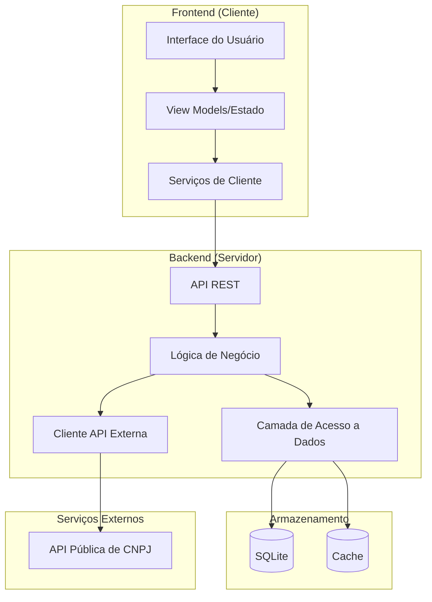
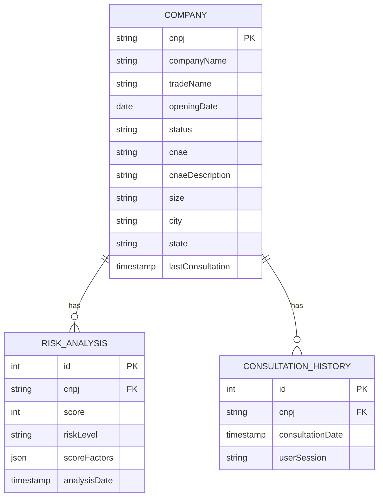
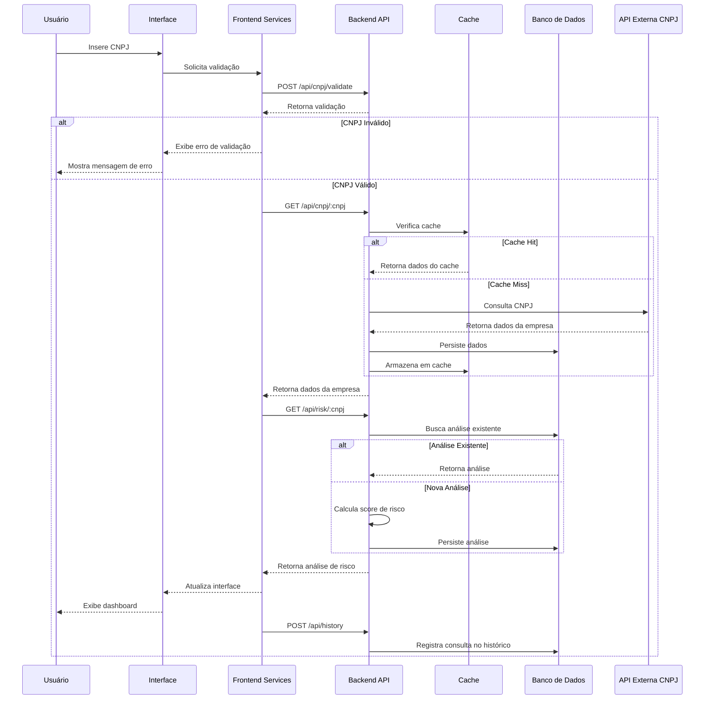

# Documento de Arquitetura - Analisador de Risco de Cliente PJ via CNPJ

## Visão Geral da Arquitetura

O **Analisador de Risco de Cliente PJ via CNPJ** seguirá uma arquitetura de aplicação web moderna, baseada em camadas e orientada a serviços. A arquitetura foi projetada para ser simples, eficiente e escalável, adequada para uma demonstração, mas com potencial para evolução futura.

## Diagrama de Arquitetura

## Tecnologias Selecionadas

### Frontend
- **Framework**: React.js (v18+)
  - **Justificativa**: React oferece uma abordagem moderna baseada em componentes, com ampla adoção no mercado e excelente ecossistema de bibliotecas.
- **Biblioteca UI**: Material-UI
  - **Justificativa**: Fornece componentes pré-estilizados que seguem o Material Design, acelerando o desenvolvimento da interface.
- **Gerenciamento de Estado**: React Context API + Hooks
  - **Justificativa**: Solução nativa do React que atende às necessidades de gerenciamento de estado para uma aplicação deste porte, sem adicionar complexidade desnecessária.
- **Requisições HTTP**: Axios
  - **Justificativa**: Biblioteca popular para requisições HTTP com boa API e tratamento de erros.

### Backend
- **Plataforma**: Node.js (v16+)
  - **Justificativa**: Plataforma JavaScript de alta performance, ideal para APIs e serviços web, permitindo compartilhamento de código com o frontend.
- **Framework**: Express.js
  - **Justificativa**: Framework web minimalista e flexível para Node.js, ideal para criar APIs REST de forma rápida.
- **Validação**: Joi
  - **Justificativa**: Biblioteca robusta para validação de dados com sintaxe expressiva.

### Banco de Dados
- **SGBD**: SQLite
  - **Justificativa**: Banco de dados leve, sem necessidade de servidor, perfeito para demonstrações e protótipos. Facilita a portabilidade e implantação.
- **ORM**: Sequelize
  - **Justificativa**: ORM maduro para Node.js que suporta SQLite e oferece uma API clara para operações de banco de dados.

### Cache
- **Mecanismo**: Node-cache
  - **Justificativa**: Solução de cache em memória para Node.js, simples de configurar e utilizar, adequada para o escopo do projeto.

### Ferramentas de Desenvolvimento
- **Bundler**: Vite
  - **Justificativa**: Ferramenta moderna de build com Hot Module Replacement, significativamente mais rápida que alternativas como Webpack.
- **Linter**: ESLint
  - **Justificativa**: Ferramenta de análise estática que garante a qualidade e consistência do código.
- **Formatador**: Prettier
  - **Justificativa**: Mantém o estilo de código consistente entre desenvolvedores.
- **Testes**: Jest + React Testing Library
  - **Justificativa**: Ferramentas padrão da indústria para testes unitários e de componentes.

## Detalhamento dos Componentes do Sistema

### Componentes do Frontend

1. **Interface do Usuário (UI)**
   - **Responsabilidade**: Renderizar a interface visual e capturar interações do usuário.
   - **Componentes Principais**:
     - `App`: Componente raiz da aplicação.
     - `Header`: Barra superior com título e navegação.
     - `CNPJForm`: Formulário para inserção do CNPJ.
     - `CompanyInfo`: Exibição dos dados básicos da empresa.
     - `RiskDashboard`: Apresentação visual do score e classificação de risco.
     - `RiskFactors`: Listagem dos fatores que influenciaram o score.
     - `HistoryPanel`: Histórico de consultas recentes.

2. **View Models / Estado**
   - **Responsabilidade**: Gerenciar o estado da aplicação e a lógica de apresentação.
   - **Implementação**: Utilizando React Context API e Hooks personalizados.
   - **Principais Estados**:
     - Estado do formulário
     - Estado da consulta (loading, error, success)
     - Dados da empresa consultada
     - Resultado da análise de risco
     - Histórico de consultas

3. **Serviços de Cliente**
   - **Responsabilidade**: Encapsular a comunicação com o backend.
   - **Serviços Principais**:
     - `api.service.js`: Configuração e instância do Axios.
     - `cnpj.service.js`: Métodos para consulta de CNPJ e análise de risco.
     - `storage.service.js`: Gerenciamento do histórico local.

### Componentes do Backend

1. **API REST**
   - **Responsabilidade**: Expor endpoints para comunicação com o frontend.
   - **Endpoints Principais**:
     - `GET /api/health`: Verificação de saúde do servidor.
     - `POST /api/cnpj/validate`: Validação básica de formato de CNPJ.
     - `GET /api/cnpj/:cnpj`: Consulta de dados de um CNPJ específico.
     - `GET /api/risk/:cnpj`: Análise de risco de um CNPJ específico.

2. **Lógica de Negócio**
   - **Responsabilidade**: Implementar as regras de negócio da aplicação.
   - **Serviços Principais**:
     - `cnpjValidator.service.js`: Validação do formato e dígitos verificadores.
     - `riskAnalyzer.service.js`: Cálculo do score de risco com base nos critérios definidos.
     - `dataEnricher.service.js`: Enriquecimento dos dados básicos da empresa.

3. **Camada de Acesso a Dados**
   - **Responsabilidade**: Gerenciar a persistência e recuperação de dados.
   - **Componentes Principais**:
     - Modelos Sequelize para as entidades.
     - Repositórios para acesso aos dados.
     - Serviço de cache para resultados de consultas frequentes.

4. **Cliente API Externa**
   - **Responsabilidade**: Encapsular a comunicação com a API pública de CNPJ.
   - **Implementação**: Classe que abstrai os detalhes da API externa, gerencia erros e formata respostas.

## Modelo de Dados

### Entidades Principais

### Descrição das Entidades

1. **COMPANY**
   - Armazena os dados básicos da empresa consultada.
   - Chave primária: CNPJ.
   - Principais atributos: razão social, nome fantasia, data de abertura, situação cadastral, CNAE, etc.

2. **RISK_ANALYSIS**
   - Armazena os resultados da análise de risco.
   - Chave primária: ID autoincrementado.
   - Chave estrangeira: CNPJ (referencia COMPANY).
   - Principais atributos: score, nível de risco, fatores que contribuíram para o score.

3. **CONSULTATION_HISTORY**
   - Registra o histórico de consultas realizadas.
   - Chave primária: ID autoincrementado.
   - Chave estrangeira: CNPJ (referencia COMPANY).
   - Principais atributos: data da consulta, identificador da sessão do usuário.

## Fluxo de Dados e Interações

### Fluxo Principal - Consulta e Análise de Risco

## Estratégia de Integração com Sistemas Externos

### API Pública de CNPJ

A integração com a API pública de CNPJ (https://docs.cnpj.ws/referencia-de-api/api-publica/consultando-cnpj) será implementada seguindo estas diretrizes:

1. **Abstração**: A integração será encapsulada em um serviço dedicado, isolando o restante da aplicação dos detalhes específicos da API externa.

2. **Resiliência**: Implementação de mecanismos para lidar com falhas temporárias:
   - Retry com backoff exponencial para falhas transitórias.
   - Circuit breaker para falhas persistentes.
   - Fallback para dados em cache quando disponíveis.

3. **Cache**: Implementação de uma estratégia de cache para:
   - Reduzir o número de chamadas à API externa.
   - Melhorar o tempo de resposta para consultas repetidas.
   - Continuar operando parcialmente durante indisponibilidade da API.

4. **Mapeamento de Dados**: Transformação dos dados recebidos da API para o formato interno utilizado pela aplicação.

5. **Tratamento de Erros**: Tradução de erros específicos da API para códigos de erro padronizados na aplicação.

## Considerações de Segurança, Desempenho e Escalabilidade

### Segurança

1. **Validação de Entrada**:
   - Todos os inputs do usuário serão validados tanto no cliente quanto no servidor.
   - Implementação de proteção contra injeção de SQL via ORM.
   - Sanitização de inputs para prevenir XSS.

2. **Proteção contra Ataques Comuns**:
   - Implementação de rate limiting para prevenir abusos.
   - Proteção contra CSRF nas requisições POST.
   - Headers de segurança adequados (Content-Security-Policy, X-Content-Type-Options, etc.).

3. **Dados Sensíveis**:
   - Não serão armazenados dados sensíveis além do necessário.
   - Dados da sessão serão mantidos apenas temporariamente.

### Desempenho

1. **Estratégia de Cache**:
   - Cache em memória para resultados de consultas frequentes.
   - Cache de assets estáticos no frontend.
   - Implementação de ETag para recursos que não mudam frequentemente.

2. **Otimizações de Frontend**:
   - Code-splitting para carregar apenas o necessário.
   - Lazy loading de componentes menos utilizados.
   - Minificação e compressão de assets.

3. **Otimizações de Backend**:
   - Consultas eficientes ao banco de dados.
   - Paginação de resultados quando aplicável.
   - Resposta em streaming para conjuntos grandes de dados.

### Escalabilidade

Embora o sistema seja inicialmente uma demonstração, a arquitetura foi projetada considerando possível crescimento:

1. **Escalabilidade Horizontal**:
   - Arquitetura stateless que permite múltiplas instâncias.
   - Possibilidade de mover para um banco de dados mais robusto (PostgreSQL, MySQL) no futuro.

2. **Modularidade**:
   - Componentes desacoplados que podem ser escalados independentemente.
   - Interfaces bem definidas entre camadas.

3. **Preparação para o Futuro**:
   - Código organizado para facilitar a adição de novas funcionalidades.
   - Decisões arquiteturais que não limitam evolução futura.

## Estratégia de Implantação

Para a demonstração, será utilizada uma estratégia de implantação simples:

1. **Ambiente de Desenvolvimento**:
   - Executado localmente com SQLite em memória.
   - Ferramentas de desenvolvimento (ESLint, Prettier) configuradas.

2. **Build e Empacotamento**:
   - Frontend: Build com Vite gerando assets estáticos.
   - Backend: Transpilação com Babel se necessário.
   - Empacotamento em um único diretório para facilitar implantação.

3. **Execução**:
   - Servidor Node.js servindo tanto o backend quanto os assets estáticos do frontend.
   - Banco de dados SQLite local para persistência.

4. **Considerações Futuras**:
   - A arquitetura permite migração para containers Docker.
   - Possibilidade de separar frontend e backend em serviços distintos.
   - Migração para um banco de dados mais robusto conforme necessário.

## Conclusão

A arquitetura proposta para o **Analisador de Risco de Cliente PJ via CNPJ** foi projetada para ser simples, eficiente e adequada para uma demonstração, ao mesmo tempo em que incorpora boas práticas de engenharia de software. 

Utilizando tecnologias modernas e bem estabelecidas (React, Node.js, Express, SQLite), a solução pode ser implementada rapidamente, oferecendo uma experiência de usuário fluida e funcionalidades completas conforme os requisitos definidos.

A arquitetura também considera aspectos importantes como segurança, desempenho e potencial para evolução futura, garantindo que o sistema possa crescer e se adaptar a novas necessidades conforme necessário.