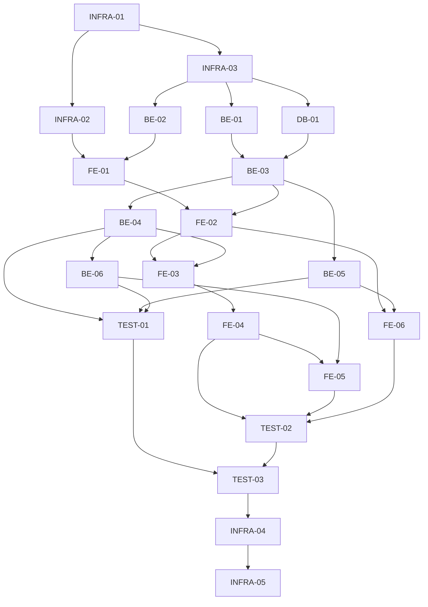

# Backlog de Desenvolvimento - Analisador de Risco de Cliente PJ via CNPJ

## Visão Geral do Plano de Desenvolvimento

Este documento detalha o backlog de desenvolvimento para o **Analisador de Risco de Cliente PJ via CNPJ**, baseado nos requisitos definidos pelo Product Manager e na arquitetura técnica estabelecida pelo Solution Architect. As tarefas estão organizadas por user story, com estimativas de esforço, dependências identificadas e ordem sugerida de implementação.

## Convenções

### Estimativas de Esforço
- **XS**: 1-2 horas
- **S**: 3-5 horas
- **M**: 6-10 horas
- **L**: 11-16 horas
- **XL**: 17-24 horas

### Identificação de Tarefas
- Formato: `[Tipo-Número]`. Exemplo: `[FE-01]`
- Tipos:
  - `FE`: Frontend
  - `BE`: Backend
  - `DB`: Banco de Dados
  - `INFRA`: Infraestrutura
  - `TEST`: Testes

## Marcos de Desenvolvimento

1. **Configuração Inicial (Sprint 0)**
   - Preparação do ambiente de desenvolvimento
   - Configuração da estrutura básica do projeto
   - Implementação da integração com API externa

2. **MVP Básico (Sprint 1)**
   - Implementação da consulta de CNPJ básica
   - Exibição de dados cadastrais
   - Cálculo simples de score

3. **Funcionalidades Completas (Sprint 2)**
   - Dashboard completo com análise visual
   - Histórico de consultas
   - Melhorias de UI/UX

4. **Finalização (Sprint 3)**
   - Testes completos
   - Otimizações de performance
   - Documentação final

## Backlog Detalhado

### Sprint 0: Configuração Inicial

#### [INFRA-01] Configuração do Ambiente de Desenvolvimento
- **Descrição**: Configurar ambiente de desenvolvimento com Node.js, npm, e ferramentas necessárias.
- **Tarefas**:
  - Instalar dependências globais (Node.js, npm)
  - Configurar ESLint e Prettier
  - Configurar ambiente de desenvolvimento com hot-reload
- **Estimativa**: XS
- **Dependências**: Nenhuma

#### [INFRA-02] Criação da Estrutura do Projeto Frontend
- **Descrição**: Criar a estrutura básica do projeto React utilizando Vite.
- **Tarefas**:
  - Inicializar projeto React com Vite
  - Configurar Material-UI
  - Configurar estrutura de diretórios
  - Configurar rotas básicas
- **Estimativa**: S
- **Dependências**: [INFRA-01]

#### [INFRA-03] Criação da Estrutura do Projeto Backend
- **Descrição**: Criar a estrutura básica da API Node.js com Express.
- **Tarefas**:
  - Inicializar projeto Node.js
  - Configurar Express
  - Configurar estrutura de diretórios
  - Implementar middleware básicos (CORS, body-parser, etc.)
  - Configurar conexão com SQLite
- **Estimativa**: S
- **Dependências**: [INFRA-01]

#### [DB-01] Implementação do Modelo de Dados
- **Descrição**: Implementar o modelo de dados usando Sequelize.
- **Tarefas**:
  - Criar modelos para Company, RiskAnalysis e ConsultationHistory
  - Configurar relacionamentos entre modelos
  - Implementar migrações iniciais
  - Criar scripts de seed para dados de teste
- **Estimativa**: M
- **Dependências**: [INFRA-03]

#### [BE-01] Implementação do Cliente da API Externa de CNPJ
- **Descrição**: Criar serviço para comunicação com a API pública de CNPJ.
- **Tarefas**:
  - Implementar cliente HTTP para a API
  - Criar métodos para consulta de CNPJ
  - Implementar tratamento de erros
  - Implementar cache de consultas
- **Estimativa**: M
- **Dependências**: [INFRA-03]

### Sprint 1: MVP Básico

#### [BE-02] Implementação da Validação de CNPJ
- **Descrição**: Criar endpoint e lógica para validação do formato e dígitos verificadores de CNPJ.
- **Tarefas**:
  - Implementar algoritmo de validação de CNPJ
  - Criar endpoint REST para validação
  - Implementar testes unitários
- **Estimativa**: S
- **Dependências**: [INFRA-03]

#### [BE-03] Implementação da Consulta de Dados Cadastrais
- **Descrição**: Criar endpoint para consulta de dados cadastrais de um CNPJ.
- **Tarefas**:
  - Criar endpoint REST para consulta
  - Integrar com o cliente da API externa
  - Implementar persistência dos dados consultados
  - Implementar tratamento de erros
- **Estimativa**: M
- **Dependências**: [BE-01], [DB-01]

#### [BE-04] Implementação do Cálculo de Score de Risco
- **Descrição**: Implementar a lógica de cálculo do score de risco conforme os critérios definidos.
- **Tarefas**:
  - Implementar algoritmo de cálculo de score
  - Criar endpoint REST para obtenção do score
  - Implementar persistência dos resultados
  - Implementar testes unitários
- **Estimativa**: M
- **Dependências**: [BE-03]

#### [FE-01] Implementação do Formulário de Consulta de CNPJ
- **Descrição**: Criar formulário para entrada do CNPJ com validação.
- **Tarefas**:
  - Implementar componente de formulário
  - Implementar validação de formato no cliente
  - Implementar feedback visual durante a validação
  - Integrar com o serviço de validação do backend
- **Estimativa**: S
- **Dependências**: [INFRA-02], [BE-02]

#### [FE-02] Implementação da Exibição de Dados Cadastrais
- **Descrição**: Criar componente para exibição dos dados básicos da empresa consultada.
- **Tarefas**:
  - Implementar componente de exibição de dados
  - Implementar estados de loading e erro
  - Integrar com o serviço de consulta do backend
- **Estimativa**: M
- **Dependências**: [FE-01], [BE-03]

#### [FE-03] Implementação da Exibição Básica do Score
- **Descrição**: Criar componente para exibição do score e classificação de risco.
- **Tarefas**:
  - Implementar componente de exibição do score
  - Implementar indicação visual da classificação de risco
  - Integrar com o serviço de cálculo de score do backend
- **Estimativa**: S
- **Dependências**: [FE-02], [BE-04]

### Sprint 2: Funcionalidades Completas

#### [BE-05] Implementação do Histórico de Consultas
- **Descrição**: Criar endpoints para gerenciamento do histórico de consultas.
- **Tarefas**:
  - Implementar endpoint para registro de consulta
  - Implementar endpoint para obtenção do histórico
  - Implementar lógica de associação com sessão do usuário
- **Estimativa**: S
- **Dependências**: [BE-03]

#### [BE-06] Implementação de Detalhes dos Fatores de Risco
- **Descrição**: Expandir API de score para incluir detalhamento dos fatores que influenciaram o score.
- **Tarefas**:
  - Modificar algoritmo de score para registrar fatores
  - Atualizar endpoint REST para incluir detalhes
  - Atualizar modelo de persistência
- **Estimativa**: S
- **Dependências**: [BE-04]

#### [FE-04] Implementação do Dashboard Completo
- **Descrição**: Criar dashboard visual completo com todos os elementos da análise de risco.
- **Tarefas**:
  - Implementar layout responsivo do dashboard
  - Criar componentes visuais para diferentes indicadores
  - Implementar transições e animações
- **Estimativa**: L
- **Dependências**: [FE-03]

#### [FE-05] Implementação do Detalhamento dos Fatores de Risco
- **Descrição**: Criar componente para exibição detalhada dos fatores que influenciaram o score.
- **Tarefas**:
  - Implementar componente de listagem de fatores
  - Implementar exibição visual do impacto de cada fator
  - Integrar com o serviço de detalhamento do backend
- **Estimativa**: M
- **Dependências**: [FE-04], [BE-06]

#### [FE-06] Implementação do Histórico de Consultas
- **Descrição**: Criar componente para exibição e interação com o histórico de consultas.
- **Tarefas**:
  - Implementar componente de listagem do histórico
  - Implementar funcionalidade de reconsulta a partir do histórico
  - Integrar com o serviço de histórico do backend
- **Estimativa**: M
- **Dependências**: [FE-02], [BE-05]

### Sprint 3: Finalização

#### [TEST-01] Testes Unitários do Backend
- **Descrição**: Implementar testes unitários abrangentes para o backend.
- **Tarefas**:
  - Implementar testes para validadores
  - Implementar testes para serviços de negócio
  - Implementar testes para endpoints da API
- **Estimativa**: L
- **Dependências**: [BE-04], [BE-05], [BE-06]

#### [TEST-02] Testes de Componentes do Frontend
- **Descrição**: Implementar testes para os componentes React.
- **Tarefas**:
  - Implementar testes para componentes de formulário
  - Implementar testes para componentes de exibição
  - Implementar testes para integração entre componentes
- **Estimativa**: L
- **Dependências**: [FE-04], [FE-05], [FE-06]

#### [TEST-03] Testes de Integração
- **Descrição**: Implementar testes que verificam a integração entre frontend e backend.
- **Tarefas**:
  - Implementar testes de fluxo completo
  - Implementar testes de casos de erro
  - Implementar testes de performance básicos
- **Estimativa**: M
- **Dependências**: [TEST-01], [TEST-02]

#### [INFRA-04] Otimizações de Performance
- **Descrição**: Implementar otimizações para melhorar o desempenho da aplicação.
- **Tarefas**:
  - Otimizar carregamento de assets no frontend
  - Implementar lazy loading de componentes
  - Otimizar consultas ao banco de dados
  - Refinar estratégia de cache
- **Estimativa**: M
- **Dependências**: Todas as funcionalidades implementadas

#### [INFRA-05] Documentação Final
- **Descrição**: Criar documentação completa do projeto.
- **Tarefas**:
  - Atualizar README com instruções detalhadas
  - Documentar APIs com Swagger/OpenAPI
  - Criar documentação de arquitetura final
  - Documentar procedimentos de implantação
- **Estimativa**: M
- **Dependências**: Todas as tarefas anteriores

## Resumo das Dependências e Fluxo de Desenvolvimento

## Estimativa Total de Esforço

| Sprint | Tarefas | Estimativa Total |
|--------|---------|------------------|
| Sprint 0 | 5 | 19-31 horas |
| Sprint 1 | 6 | 23-41 horas |
| Sprint 2 | 5 | 27-47 horas |
| Sprint 3 | 5 | 34-56 horas |
| **Total** | **21** | **103-175 horas** |

## Recomendações para Implementação

1. **Priorização**:
   - Focar primeiro na configuração da infraestrutura e integração com a API externa
   - Implementar o fluxo básico completo (consulta > exibição > análise) antes de refinar detalhes

2. **Desenvolvimento Paralelo**:
   - Backend e frontend podem ser desenvolvidos em paralelo após a conclusão das tarefas de infraestrutura
   - Utilizar mocks para permitir desenvolvimento independente

3. **Gerenciamento de Riscos**:
   - A integração com a API externa é um ponto crítico - começar cedo e ter um plano B (dados mockados)
   - Dedicar tempo adequado aos testes para garantir a qualidade da entrega

4. **Incremental**:
   - Implementar uma abordagem incremental, garantindo que o sistema seja funcional ao final de cada sprint
   - Priorizar o MVP (Minimum Viable Product) nas primeiras sprints

## Próximos Passos

1. Revisar o backlog com a equipe de desenvolvimento
2. Confirmar estimativas e dependências
3. Iniciar Sprint 0 com foco na configuração do ambiente e estrutura básica
4. Agendar checkpoints regulares para avaliar o progresso e ajustar o plano conforme necessário

---

Este documento de backlog serve como guia para o desenvolvimento do sistema "Analisador de Risco de Cliente PJ via CNPJ" e pode ser refinado ao longo do processo de desenvolvimento.